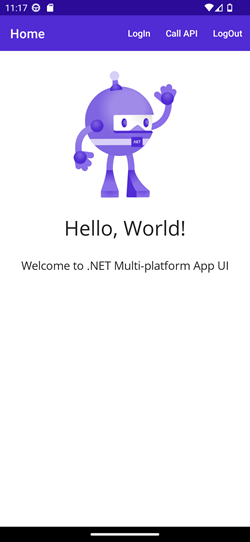
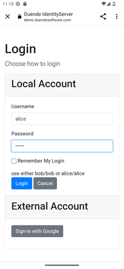
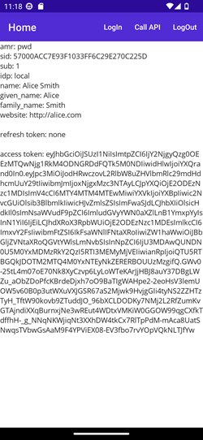
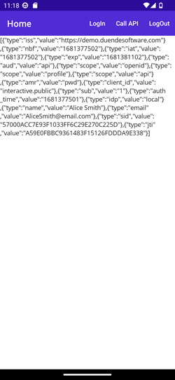
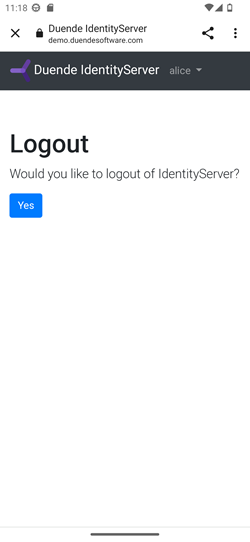
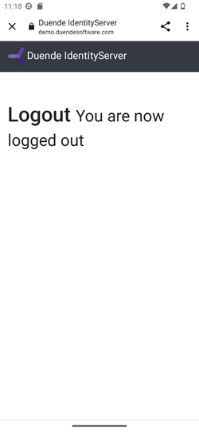

# OidcMobileClient

Ref.: [Add Authentication to .NET MAUI Apps with Auth0](https://auth0.com/blog/add-authentication-to-dotnet-maui-apps-with-auth0/)
Ref.: [auth0-blog/dotnet-maui-auth0-app](https://github.com/auth0-blog/dotnet-maui-auth0-app)

Benytter følgende konfiguration af Identityserver:

    Domain = "demo.duendesoftware.com",
    ClientId = "interactive.public",
    Scope = "openid profile api",
    RedirectUri = "myapp://callback"

Fungerer også for Auth0 som IdentityProvider. Bemærk ændringen i klassen `Auth0Client` og metoden `LogoutAsync()`, hvor `endSessionUrl` er forskellig mellem Duende og Auth0

Som WebApi er anvendt Duende IdentityServeren. Ønske man ikke at kalde et WebApi er der to steder der skal justeres:

- `Auth0Client.LoginAsync()`: Undlad at oprette `Parameters`
- `MainPage.cs:` Fjern oprettelse af apiClient i constructoren og fjern kaldet til den i `OnLoginClicked()`.

&nbsp;

### Windows

Virker også for Windows (dog ikke ved logout).

Bemærk tilføjelsen af `<WebView x:Name="WebViewInstance" />` i `MainPage.xaml`.

&nbsp;

|   |   |   |
|---|---|---|
|   |   |   |